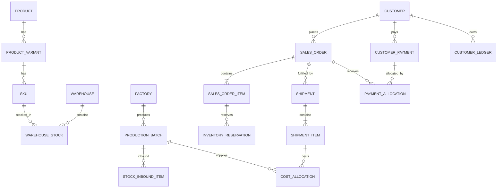

# Helen 服装批发管理系统：字段与数据联通设计

> 文档版本：1.0  
> 当前实现目标：纯前端、单用户、本地持久化；为以后接真实后端保留清晰的数据边界。  
> 业务口径：人民币、金额精确到分、库存单位为件、允许多仓库和部分发货/部分收款。

## 1. 数据设计原则

1. 每一类业务事实只保存一份：
   - 库存事实保存在“仓库 + SKU”库存记录中；
   - 订单应收由订单金额和收款分配计算；
   - 已发货数量由发货明细累计；
   - 客户汇总、看板和财务报表全部由事实数据派生。
2. 商品不保存一个永久成本。成本属于生产批次，发货成本应按出库批次分摊。
3. 订单确认只增加预留库存，不减少实际库存；发货时同时减少实际库存和对应预留。
4. 收款可以部分核销订单；超过未收金额的部分进入客户预存款。
5. 已被业务单据引用的资料不应物理删除，应改为停用或取消。
6. 单据保存业务快照。客户或商品以后改名，历史订单、发货单和 Receipt 仍显示当时内容。
7. 当前阶段使用浏览器 `localStorage` 保存统一业务状态，并带数据版本号；以后可将同一套命令和校验迁移到 API/数据库。

## 2. 通用字段与数值口径

所有主数据和单据建议包含：

| 字段 | 类型 | 说明 |
| --- | --- | --- |
| `id` | string | 内部稳定主键，不用于展示 |
| `createdAt` | ISO datetime | 创建时间 |
| `updatedAt` | ISO datetime | 最后修改时间 |
| `status` | enum | 当前业务状态 |
| `notes` | string | 内部备注 |

数值规则：

- 金额在业务模型中应使用整数分（`Cents`）；现有页面兼容层暂以人民币元显示，进入后端时统一转为分。
- 数量必须为非负整数。
- `sellableStock = actualStock - reservedStock`，不得依靠表单手工填写。
- 所有合计、小计、应收、欠款、库存状态都由明细计算。

## 3. 核心实体与字段

### 3.1 Customer 客户

录入字段：

- `id`、`customerNo`
- `name`、`companyName`
- `country`、`city`
- `whatsappCountryCode`、`whatsappNumber`（当前兼容字段为 `whatsapp`）
- `alternateContact`
- `frequentCategories`
- `frequentStyleNos`
- `commonSizes`
- `priceRangeMinCents`、`priceRangeMaxCents`
- `manualStatus`
- `tags`
- `notes`
- `createdAt`、`updatedAt`

派生字段（不可独立手改）：

- `lastPurchaseDate`
- `totalOrderCount`
- `totalSales`
- `orderReceivable`
- `shippedDebt`
- `presaveBalance`
- `pendingShipQty`
- `avgOrderAmount`
- `lastPaymentDate`
- `calculatedStatus`

### 3.2 Product 商品款式

- `id`
- `styleNo`：唯一款号
- `name`
- `category`
- `images`
- `suggestedPriceCents`
- `newDate`
- `status`：设计中、生产中、已上新、正常销售、库存不足、已停售
- `description`
- `notes`
- `createdAt`、`updatedAt`

不保存永久采购成本；页面上的“最近成本”由最近生产批次派生。

### 3.3 ProductVariant 颜色款

- `id`
- `productId`
- `colorName`
- `colorCode`
- `hexColor`
- `images`
- `status`
- `createdAt`、`updatedAt`

### 3.4 SKU

- `id`
- `skuCode`：唯一
- `productId`
- `variantId`
- `size`
- `barcode`
- `image`
- `status`
- `createdAt`、`updatedAt`

当前界面可由 `款号 + 颜色 + 尺码` 唯一识别 SKU；正式后端应保存独立 `skuId`。

### 3.5 Warehouse 仓库

- `id`
- `warehouseNo`
- `name`
- `city`
- `address`
- `contact`
- `status`
- `notes`
- `createdAt`、`updatedAt`

### 3.6 WarehouseStock 仓库 SKU 库存

- `id`
- `warehouseId`
- `skuId`（当前兼容键为款号、颜色、尺码）
- `actualQty`
- `reservedQty`
- `lowStockThreshold`
- `updatedAt`

派生：`sellableQty`、库存预警状态。

唯一约束：`warehouseId + skuId`。

### 3.7 InventoryReservation 库存预留

- `id`
- `orderId`
- `orderItemId`
- `customerId`
- `warehouseId`
- `skuId`
- `reservedQty`
- `shippedQty`
- `releasedQty`
- `status`：有效、部分履行、已履行、已释放
- `reservedAt`
- `releasedAt`
- `createdAt`、`updatedAt`

### 3.8 InventoryTransaction 库存流水

- `id`、`transactionNo`
- `date`
- `type`：生产入库、手工入库、销售预留、取消预留、销售出库、仓库调拨、库存调整
- `warehouseId`
- `skuId`
- `actualQtyDelta`
- `reservedQtyDelta`
- `actualBefore`、`actualAfter`
- `reservedBefore`、`reservedAfter`
- `referenceType`、`referenceId`、`referenceNo`
- `notes`
- `createdAt`

任何库存变化都必须同时生成流水。

### 3.9 StockInbound / StockInboundItem 入库单

入库单：

- `id`、`inboundNo`
- `type`：生产入库、手工入库、期初库存
- `batchId`、`factoryId`
- `warehouseId`
- `inboundDate`
- `reason`
- `status`
- `notes`
- `createdAt`、`updatedAt`

入库明细：

- `id`
- `inboundId`
- `skuId`
- `warehouseId`
- `quantity`
- `unitCostCents`
- `totalCostCents`
- `notes`

### 3.10 StockTransfer / StockTransferItem 调拨

调拨单：

- `id`、`transferNo`
- `fromWarehouseId`
- `toWarehouseId`
- `transferDate`
- `status`
- `notes`
- `createdAt`、`updatedAt`

明细：

- `id`
- `transferId`
- `skuId`
- `quantity`

调拨必须在同一事务中扣减调出仓、增加调入仓，并生成两条库存流水。

### 3.11 Factory 工厂

- `id`、`factoryNo`
- `name`
- `contact`
- `phone`
- `mainCategory`
- `address`
- `status`
- `notes`
- `createdAt`、`updatedAt`

累计生产、已付和未付均由批次与付款派生。

### 3.12 ProductionBatch 生产批次

- `id`、`batchNo`
- `factoryId`
- `productId`
- `skuId`
- `plannedWarehouseId`
- `productionQty`
- `unitCostCents`
- `startDate`
- `expectedFinishDate`
- `inboundDate`
- `status`
- `notes`
- `createdAt`、`updatedAt`

派生：总成本、已入库数量、剩余入库数量、已付、未付。

### 3.13 FactoryPayment / Allocation / Ledger 工厂付款

工厂付款：

- `id`、`paymentNo`
- `factoryId`
- `paymentDate`
- `amountCents`
- `method`
- `voucher`
- `notes`

付款分配：

- `id`
- `factoryPaymentId`
- `batchId`
- `allocatedAmountCents`

工厂账本：

- `id`
- `factoryId`
- `date`
- `businessType`
- `referenceId`、`referenceNo`
- `payableIncreaseCents`
- `paidAmountCents`
- `runningBalanceCents`
- `notes`

### 3.14 SalesOrder 销售订单

- `id`、`orderNo`
- `customerId`
- 客户快照：`customerName`、`country`、`whatsapp`
- `orderDate`
- `status`：草稿、待确认、已确认、部分发货、已全部发货、已完成、已取消
- `currency`（固定 CNY）
- `depositAppliedCents`
- `notes`
- `createdAt`、`updatedAt`

派生：总件数、订单金额、已收、未收、已发货、待发货、最终应收。

### 3.15 SalesOrderItem 订单明细

- `id`
- `orderId`
- `productId`、`skuId`
- 商品快照：`styleNo`、`productName`、`color`、`size`
- `warehouseId`、`warehouseName`
- `orderedQty`
- `unitPriceCents`
- `notes`

派生：小计、已发数量、待发数量。

### 3.16 Shipment / ShipmentItem 发货

发货单：

- `id`、`shipmentNo`
- `orderId`、`orderNo`
- `customerId`、`customerName`
- `shipDate`
- `warehouseId`、`warehouseName`
- `logisticsMethod`
- `trackingNo`
- `status`
- `notes`
- `createdAt`、`updatedAt`

发货明细：

- `id`
- `shipmentId`
- `orderItemId`
- `skuId`
- 商品快照
- `thisShipQty`
- `unitPriceCents`
- `thisShipAmountCents`

### 3.17 CustomerPayment / PaymentAllocation 客户收款

收款：

- `id`、`paymentNo`
- `customerId`、`customerName`
- `paymentDate`
- `amountCents`
- `method`
- `voucher`
- `notes`
- `createdAt`

收款分配：

- `id`
- `paymentId`
- `orderId`
- `allocatedAmountCents`

若收款未指定订单，默认按最早未结订单依次核销；剩余金额进入客户预存款。

### 3.18 DepositApplication 预存款使用

- `id`
- `customerId`
- `orderId`
- `applicationDate`
- `amountCents`
- `notes`
- `createdAt`

余额必须大于等于使用金额，使用后同时增加订单已收。

### 3.19 CustomerLedgerEntry 客户往来账

- `id`
- `customerId`
- `date`
- `businessType`：订单、发货、收款、预存款使用、余额调整
- `referenceId`、`docNo`
- `description`
- `receivableIncreaseCents`
- `receivedAmountCents`
- `depositIncreaseCents`
- `depositDecreaseCents`
- `receivableBalanceCents`
- `depositBalanceCents`
- `notes`
- `createdAt`

### 3.20 CostAllocation 成本分摊

- `id`
- `shipmentItemId`
- `productionBatchId`
- `quantity`
- `unitCostCents`
- `totalCostCents`
- `createdAt`

按先进先出或人工指定批次分摊；这是销售利润的成本来源。

### 3.21 其他辅助实体

- `Receipt`：不单独存金额，以订单、发货和收款事实实时生成。
- `NewArrivalCampaign`、`NewArrivalRecipient`：上新通知及发送结果。
- `ImportJob`、`ImportFieldMapping`、`ImportIssue`：导入任务、字段映射和错误行。
- `AppSettings`：商家名称、联系方式、编号规则、默认低库存阈值、数据版本等。

## 4. 实体关系

## 5. 完整业务生命周期

1. 新增客户：只创建客户主数据，所有财务汇总为 0。
2. 新增商品：创建款式及颜色、尺码组合；尚未入库时库存为 0。
3. 商品入库：
   - 创建或更新仓库 SKU 库存；
   - 实际库存增加，预留不变；
   - 写入入库/库存流水；
   - 商品库存汇总随即变化。
4. 新建订单草稿：
   - 保存客户和商品快照；
   - 不改变库存、不产生应收。
5. 确认订单：
   - 校验每行可销售库存；
   - 创建预留记录；
   - 库存 `reservedQty` 增加，`actualQty` 不变；
   - 订单计入客户订单应收和待发货。
6. 部分/全部发货：
   - 每行发货量不得超过订单剩余量和对应预留；
   - 实际库存、预留库存同步减少；
   - 创建发货单和销售出库流水；
   - 更新订单已发/待发和客户已发货欠款。
7. 部分/全部收款：
   - 创建收款记录；
   - 指定订单时优先核销该订单，否则按最早未收订单核销；
   - 更新订单已收、未收；
   - 超额部分增加客户预存款；
   - 写入客户往来账。
8. 已有预存款抵扣订单：
   - 不创建新的现金收款记录；
   - 抵扣金额不得超过客户预存余额或订单未收金额；
   - 客户预存余额减少，订单已收增加、未收减少；
   - 创建独立预存款抵扣记录，并写入客户往来账；
   - 预存款与订单欠款相等时允许一次结清。
9. 完成：
   - 当订单已全部发货且未收金额为 0，状态自动变为“已完成”；
   - Receipt 始终从当前订单和收款数据生成。

## 6. 强制校验

- 款号唯一；SKU 编码唯一；仓库 + SKU 库存记录唯一。
- 订单、入库、发货、调拨的数量必须是正整数。
- 确认订单不得超过可销售库存。
- 取消已确认订单必须释放尚未发货的预留库存。
- 发货量不得超过订单未发数量。
- 实际库存、预留库存、可销售库存不得为负数。
- 低库存预警按可销售库存判断；汇总数量以“仓库 + 款号 + 颜色 + 尺码”的 SKU 库存记录为单位，不把多个 SKU 误称为多个款式。
- 收款金额必须大于 0；订单未收金额不得为负数。
- 超额收款只能进入同一客户的预存款。
- 被订单或库存引用的商品、客户、仓库不得硬删除。
- 每次库存变化必须有库存流水，每次财务变化必须有往来账。

## 7. 当前前端实现边界

本轮实现覆盖：

- 客户、商品、仓库 SKU 库存；
- 工厂、生产批次、生产入库及单批次工厂付款；
- 商品入库、订单草稿/确认和库存预留；
- 部分/全部发货和库存扣减；
- 部分/全部收款、自动核销、超额预存及已有预存款抵扣订单；
- 客户往来账、订单 Receipt；
- 客户、应收、看板等页面的实时派生；
- Excel/CSV 数据迁入、字段映射、校验、重复处理、模板和本地导入历史；
- `localStorage` 版本化持久化和从零重置能力。

后续接真实后端时补充：

- 并发库存锁、数据库事务、权限和审计；
- 独立 SKU/颜色款维护页；
- 生产批次成本 FIFO 分摊；
- 跨多个批次的工厂付款自动分配；
- PDF 和消息发送。
